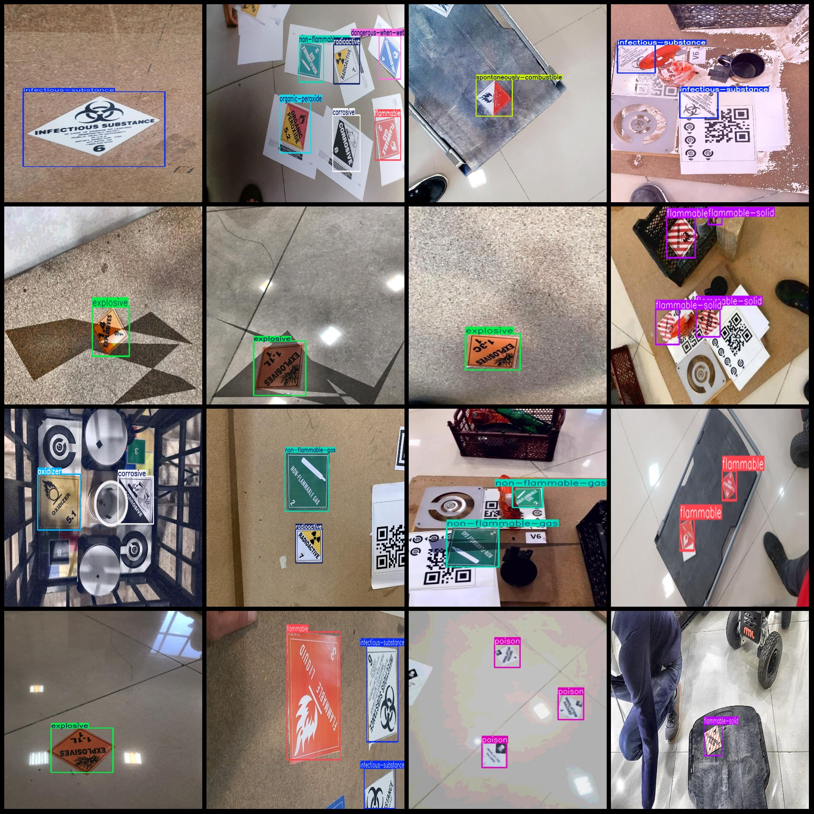
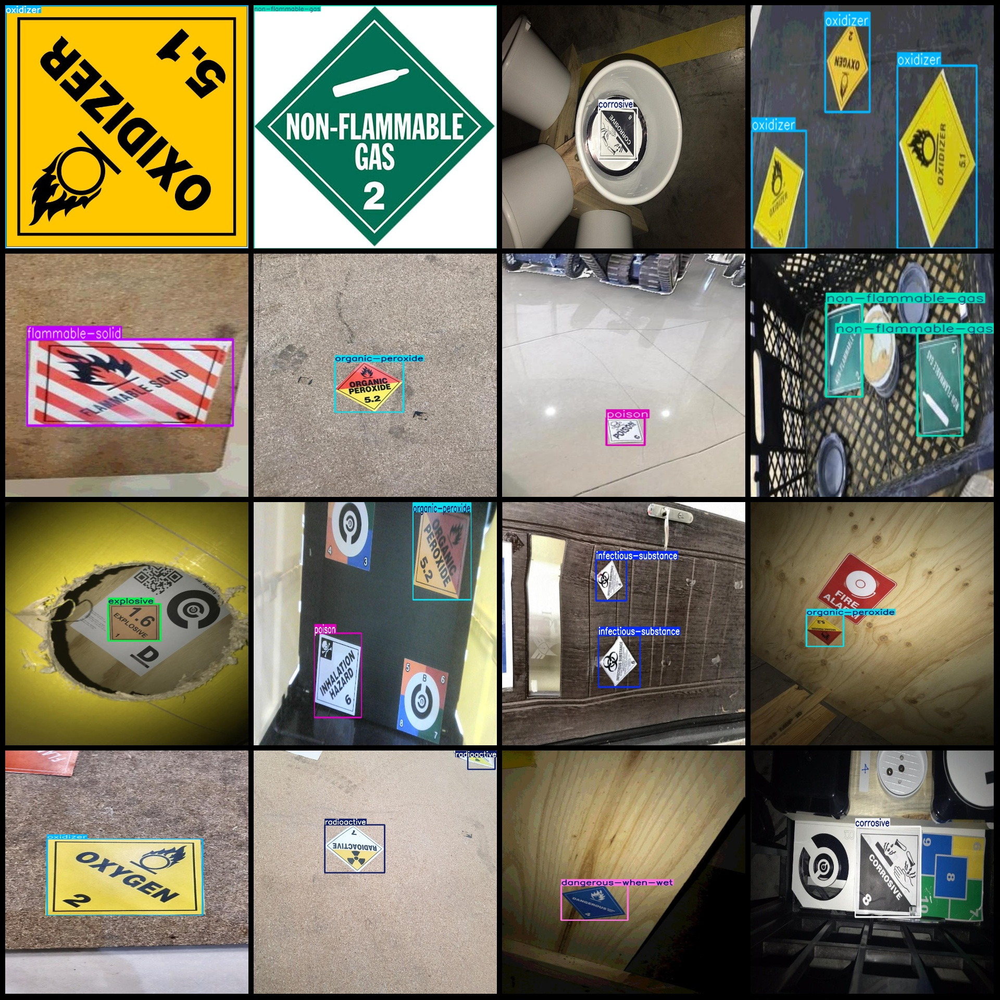

# Dangerous Goods Classification and Labeling Identification Detection Dataset in VOC+YOLO Format with 2394 Images in 12 Categories

Dataset format: Pascal VOC format + YOLO format (txt file without split path, only containing jpg images and corresponding VOC format xml files and yolo format txt files)
Number of images (jpg file count): 2394
Number of annotations (xml file count): 2394
Number of annotations (txt file count): 2394
Number of annotation categories: 12
Annotation category names (note that the order in the yolo format is not consistent with this, but follows the labels folder classes.txt): ["corrosive", "dangerous-when-wet", "explosive", "flammable", "flammable-solid", "infectious-substance", "non-flammable-gas", "organic-peroxide", "oxidizer", "poison", "radioactive", "spontaneously-combustible"]
Box counts for each category:
corrosive box count = 324
dangerous-when-wet box count = 313
explosive box count = 513
flammable box count = 358
flammable-solid box count = 326
infectious-substance box count = 341
non-flammable-gas box count = 298
organic-peroxide box count = 283
Oxidizer (oxidant) frame count = 331
poison box count = 533
radioactive box count = 423
spontaneously-combustible box count = 296
Application Fields: These are common categories of dangerous goods classification and labeling.
Total frames: 4339
Image resolution: Multi-resolution images, such as 520x388, 485x1000, etc.
Use the annotation tool: labelImg.
Rules for annotation: Draw a rectangle around the category.
Important notes: None.
Special Notice: This dataset does not guarantee the accuracy of the trained model or weight files.
## Images

Here is a pay link on Stripe ( https://buy.stripe.com/3cs8yP7sY87d0vu9AB ). Please contact me lonlonago@foxmail.com after funding $89, and I will send you a complete data files , thank you!

